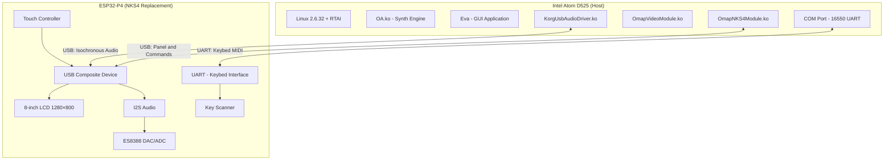
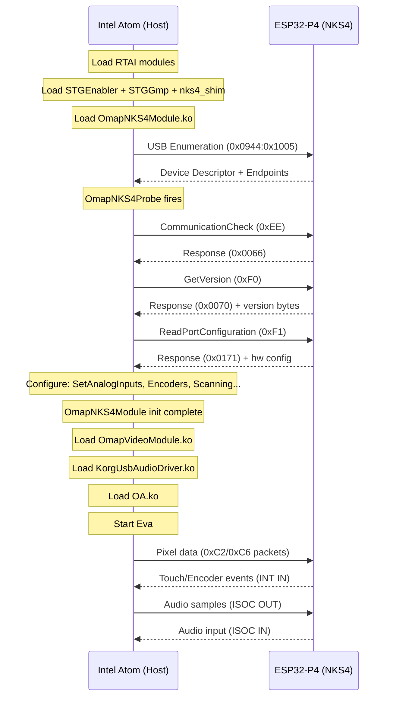

# Emulation Architecture and Virtualization Specification {#sec:emulation-architecture}

To execute Korg's proprietary real-time synthesis engine on commodity x86 hardware, the legacy NKS4 coprocessor board is replaced with a modern ESP32-P4 microcontroller. This microcontroller interfaces with an Intel Atom-based Host CPU via standard USB and UART pathways.

## Host-Coprocessor Emulation Mapping {#sec:hardware-emulation-mapping}

The physical and logical mapping of the emulation platform mirrors the original dual-processor boundaries:

{#fig:arch-emulation}



## Software Driver Load Hierarchy {#sec:software-stack}

The Host execution environment constructs its software stack by loading kernel-space modules in a strict dependency sequence prior to launching the userspace GUI shell `Eva`:

| Load Rank | Kernel Module | Functional Responsibility |
| :---: | :--- | :--- |
| 1 | `rtai_hal.ko` | Hardware Abstraction Layer for RTAI |
| 2 | `rtai_sched.ko` | Hard real-time task scheduler |
| 3 | `rtai_sem.ko` | Real-time semaphore synchronization primitives |
| 4 | `rtai_fifos.ko` | High-speed real-time inter-process FIFO communication |
| 5 | `rtai_ndbg.ko` | Real-time debug trap registration |
| 6 | `STGEnabler.ko` | Exports standard `stg_usb_*` wrapper APIs |
| 7 | `OmapNKS4Module.ko` | Primary NKS4 USB control path driver |
| 8 | `OmapVideoModule.ko` | Framebuffer module exposing `/dev/fb1` |
| 9 | `KorgUsbAudioDriver.ko` | Isochronous USB audio and MIDI driver |
| 10 | `STGGmp.ko` | Exports GMP arbitrary-precision integer math (`__gmpz_*`) |
| 11 | `USBMidiAccessory.ko` | External USB MIDI accessory driver |
| 12 | `loadmod.ko` | DRM manager, integrity verifier, and cryptoloop decrypter |
| 13 | `OA.ko` | Real-time synthesis engine and core DSP module |
| — | `Eva` (Userspace) | Primary PEG-based GUI application |

## Unified Host-Coprocessor Boot Handshake {#sec:boot-sequence}

Initialization of the Host kernel modules triggers a deterministic USB and UART handshake sequence with the ESP32-P4 coprocessor:

{#fig:boot-sequence}



---

## Deterministic Software-in-the-Loop Simulation (QEMU Platform) {#sec:qemu-emulation}

To facilitate deterministic, reproducible systems verification, a software-in-the-loop (SIL) testing environment is implemented using QEMU. The virtualized Host connects to an emulated NKS4 USB device (`hw/usb/dev-nks4.c`) and an emulated Super I/O keybed UART serial controller.

### Operational Divergences: QEMU vs. Physical Emulation Target {#sec:qemu-why}

The virtualized QEMU environment introduces key differences from the physical x86-ESP32-P4 deployment:

| Parameter | QEMU Virtual Environment | Physical Hardware Target (D525 + ESP32) |
| :--- | :--- | :--- |
| **`loadmod.ko` Integrity** | Requires 4 relocation NOP patches | Relocates cleanly (original binary unmodified) |
| **`OA.ko` Authorization** | Requires 1-byte Atmel auth bypass | Operates unmodified (ESP32 emulates Atmel chip) |
| **Keybed Serial Path** | Virtual Super I/O & UART device (`dev-keybed`) | Physical 16550 UART (D525 COM Port ↔ ESP32) |
| **`orig_mem_size` Initialization** | Kernel parameter `memmap=0x80000000@0` | BIOS MTRR cleanup configures automatically |
| **Filesystem Encryption** | Bypass via pre-decrypted loopback mount | Standard cryptoloop (ESP32 provides keys) |

---

## Real-Time Virtualization Mechanics & Hypervisor Constraints {#sec:qemu-no-kvm}

The Host's RTAI extension utilizes an Interrupt Pipeline (`I-pipe`) to intercept low-level hardware interrupts, scheduling real-time threads in Ring 0. 

In virtualized environments accelerated by KVM (`-enable-kvm`), the KVM hypervisor's virtual APIC (Local Advanced Programmable Interrupt Controller) timer injection mechanism is unable to deliver interrupts in synchronization with the hard real-time constraints of RTAI's I-pipe. This discrepancy causes host kernel execution threads to starve (specifically preventing `ProcessMsgRoutine` from scheduling), halting system initialization.

Consequently, **full instruction-level emulation (TCG mode)** is mandatory for virtualization. The Host kernel requires the `lapic` boot parameter to bind RTAI to the emulated local APIC timer, ensuring stable real-time interrupt scheduling.

---

## Dynamic Relocation & Hardware Bypass Specifications {#sec:qemu-patches}

In the QEMU environment, or when deploying on custom x86 host boards where kernel-space module addresses diverge from Korg's original CompactFlash layout, binary patches are specified to bypass relocational integrity and hardware checks:

### `loadmod.ko` Relocation Patch Map {#sec:loadmod-patches}

`loadmod.ko` contains integrity verification routines that hash the relocated `.text` and `.data` blocks. Because vmalloc allocation addresses in QEMU differ from original Kronos hardware, these checks fail, triggering an initialization abort. Four binary NOP patches are applied to `.init.text` (see [Appendix F](#sec:appendix-patches) for the complete version-specific patch table with checksums).

### `OA.ko` Authorization Bypass

When the physical Atmel AT88SC0204CA cryptographic memory chip is absent, a single-byte patch at `.init.text+0x19f` converts a conditional jump to an unconditional jump, bypassing the hardware challenge-response verification. This offset is identical across all known firmware versions (see [Appendix F](#sec:appendix-patches)).

### Physical Memory Topology Declaration (`memmap=` Kernel Parameter) {#sec:memmap-param}

On stock Kronos hardware, the system BIOS programs Memory Type Range Registers (MTRRs) to describe the installed physical RAM topology. During early kernel initialization, the Korg-patched MTRR cleanup routine parses these registers, updates the E820 memory map, and executes an internal "ORIG Checking" sweep to locate the largest contiguous RAM region. The result is stored in the exported kernel symbol `orig_mem_size`.

In QEMU, the MTRR cleanup path is never triggered (the emulated MTRR state does not satisfy the cleanup entry conditions). Consequently, `orig_mem_size` remains at zero, causing `OA.ko`'s `InitializeSTGHeap` to compute an invalid ioremap size.

The solution exploits the Korg kernel's custom `memmap=` boot parameter handler. When a `memmap=` entry includes the `@` separator (denoting a RAM region declaration), the handler populates an internal memory descriptor table. The subsequent "ORIG Checking" sweep then discovers this entry and sets `orig_mem_size` accordingly:

```
memmap=0x80000000@0   → Declares 2GB physical RAM starting at address 0
memmap=384m           → Limits kernel-visible RAM to 384MB (standard Kronos parameter)
```

Both parameters are specified on the kernel command line. The first informs the Korg memory subsystem of the total installed RAM; the second constrains the kernel's direct-mapped region, reserving the remainder for the STG Heap ioremap allocation.

> **Note:** On physical D525 hardware with a standard BIOS, only `memmap=384m` is required (matching the original `grub.conf`). The MTRR cleanup path handles `orig_mem_size` automatically.

---

## Cryptoloop Bypass and Decrypted System Image Mapping {#sec:qemu-decrypted}

On stock hardware, `loadmod.ko` replaces standard syscalls to intercept the mount path, automatically decrypting `/korg/ro` filesystem loop images using AES keys derived from the Atmel chip. 

In the emulation target, the encrypted loopback layers are bypassed by pre-decrypting the partition images using the standard 124-bit (truncated 128-bit) keys. The decrypted partitions are mounted directly to `/korg/Eva`, `/korg/Mod`, and `/korg/rw/PCM/WaveMotion`:

| Partition Image | Effective Key Length | AES-256-CBC Passphrase Key | Target Directory |
| :--- | :---: | :--- | :--- |
| **`Eva.img`** | 124-bit | `342ee59d549c7d329d835537be0540d` | `/korg/Eva` (GUI Engine) |
| **`Mod.img`** | 124-bit | `a336a15cd841ec8926b99e7c3884eaa` | `/korg/Mod` (System Modules) |
| **`WaveMotion.img`** | 124-bit | `3e72c0e59fc017a9eb7d7e1168a4cdb` | `/korg/rw/PCM/WaveMotion` (Samples) |

---

## `OA.ko` Subsystem Initialization Workflow {#sec:oa-init}

Once all dependencies are resolved, the synthesis engine `OA.ko`'s `init_module` routine (allocated at `.init.text+0x000` to `0x2F6` in `OA.ko`) executes a complex 17-step C++ and real-time initialization sequence:

### Comprehensive 17-Step Initialization Sequence

1.  **`init_cpp_support`**: Invokes Korg's C++ static global initialization helper (reconstructed as a no-op stub).
2.  **Host CPU Capability Verification**: Directly executes a CPUID query. Requires hardware support for `SSE2`, `SSE3`, and `SSSE3`. If these capabilities are missing, the driver writes `"cpu cap"` to `/tmp/startupErrorLog` and aborts.
3.  **Core Affinity Binding (`stg_set_cpus_allowed`)**: Pins the initialization kernel thread execution strictly to CPU 0 to prevent scheduling context switches.
4.  **UI Progress Monitor Kill**: Inspects `/tmp/progress.pid`, extracts the process identifier, and issues a standard `SIGKILL` signal to terminate the boot progress bar helper.
5.  **Synth Heap Memory Allocation (`InitializeSTGHeap`)**: Reads `orig_mem_size` to establish physical memory boundaries. Executes the STG Heap allocation and registers the RTAI DMA ioremap memory spaces.
6.  **`InitSharedMemProcInterface`**: Registers the virtual Host control interface mapping at `/proc/sharedmem`.
7.  **`InitPcmModProcInterface`**: Registers the virtual Host PCM mapping interface at `/proc/pcmmod`.
8.  **Engine Resource Allocation (`setup_global_resources`)**: Allocates the memory pools for all synthesized DSP engine objects, including voices, effects processors, and program buffers.
9.  **NV2AC Coprocessor Authorization (`SetupAtmelForAuthorizations`)**: Executes the multi-stage hardware licensing handshake with the Atmel AT88SC0204CA chip. System sound volume initialization is gated by the success of this routine.
10. **Sound Resource Streaming (`load_global_resources`)**: Scans the mounted filesystem and streams sound banks and multisamples from `WaveMotion.img` into system memory.
11. **`SetInstalledOptions`**: Scans licensing descriptors and enables expansion presets or additional synthesis algorithms based on installed authorizations.
12. **Real-Time Daemons Deployment (`setup_stg_daemons`)**: Spawns 7 hard real-time kernel-space scheduling threads managed by RTAI (handles voice scheduling, real-time MIDI frame tracking, and synthesis calculations).
13. **Audio Subsystem Activation (`CSTGAudioManager_StartAudioEngine`)**: Invokes `KorgUsbAudioInitialize` and `KorgUsbAudioStart`, dynamically loading the `KorgUsbAudioDriver.ko` framework.
14. **Keyboard Serial Path Handshake (`CSTGKeybedInterface_Startup`)**: Initializes the physical serial communications link. The routine sweeps COM ports 1 through 6, executing up to 10 retries per port to negotiate the keybed handshake.
15. **`CSTGDrumPadInterface_Initialize`**: Registers the physical drum pad and velocity button structures.
16. **`stg_rtfifo_init`**: Opens and configures the real-time FIFO channels utilized for dynamic Host-GUI userspace communications.
17. **`CSTGAudioManager_EnableAudioManagerThread`**: Enables the primary real-time audio thread, triggering high-speed PCM sample rendering.

### Initialization Error Characterization

During system boot failures, the initialization routine unwinds the loaded resources in exact reverse order. The Host driver writes specific, short error codes to `/tmp/startupErrorLog` via `stg_log_startup_error` and issues log dumps to kernel space via `rt_printk`. The verified error string mappings are:

*   `"cpu cap"`: The Host CPU lacks instruction support for SSE2, SSE3, or SSSE3.
*   `"memory error"`: The STG Heap or DMA memory allocation failed during `InitializeSTGHeap`.
*   `"authorization"`: The coprocessor challenge-response check or Atmel DRM validation failed at step 9.
*   `"alloc resources"`: Engine global object allocation failed during `setup_global_resources`.
*   `"audio threads"`: RTAI was unable to create or schedule the 7 real-time DSP daemon threads.
*   `"keybed"`: The physical keybed UART handshake failed on all COM ports.
*   `"UI fifo"`: RTAI real-time FIFO channel allocation failed during step 16.

### STG Heap Memory Allocation Mathematics

During `InitializeSTGHeap` (Step 5), the driver calculates the physical size of the DMA mapping partition using the following systems formula:

$$\text{physMemSize} = \text{orig\_mem\_size} - (\text{high\_memory} - \text{PAGE\_OFFSET})$$

Where `orig_mem_size` is established at $0x80000000$ (2048 MB) via the `memmap=0x80000000@0` kernel parameter (in QEMU) or MTRR cleanup (on physical hardware), and the kernel's high-memory boundary is situated at $0x18000000$ (384 MB) relative to the base page offset. The formula yields:

$$\text{physMemSize} = 0x80000000 - 0x18000000 = 0x68000000 \text{ Bytes } (1760 \text{ MB})$$

The driver ioremaps this $1.75\text{ GB}$ block as a single contiguous DMA memory region dedicated to real-time voice synthesis and PCM waveform lookup buffers.

---

## Keybed Serial Protocol Interface {#sec:keybed-comport}

The keybed PSoC scanner and Host `CSTGKeybedInterface` communicate over a dedicated serial interconnect mapped to COM port I/O space:

### Super I/O Hardware Emulation Specifications

The Host motherboard interfaces with the serial UART lines using an onboard Super I/O chip. To enable keybed serial communication without patching the Host driver, the virtualized or physical platform must map to the following hardware-level constants:

*   **Super I/O Configuration Port**: I/O addresses `0x4E` and `0x4F`.
*   **Super I/O Chip Identifier**: The chip ID registers must return `0x87` (conforming to the Winbond/Nuvoton Super I/O standards checked during driver init).
*   **UART Base Address Mapping**: The Super I/O logic must map COM port registers to I/O address base `0x240`.
*   **Interrupt Request Line**: The serial controller must bind to hardware `IRQ5`.
*   **Host Driver UART Configuration**: Invokes `CSTGComPort::Initialize(port_id, baud=0x18, fifo_threshold=0)` to map COM registers with FIFO buffering disabled, ensuring zero-jitter, byte-by-byte event delivery.

### Handshake Sequence and Timing

1.  The Host scans COM ports 1 through 6, initiating a raw serial configuration at baud code `0x18` (38400 bps).
2.  The Host sends a single synchronization byte `0xA5` over the UART.
3.  The Host blocks for approximately 21 milliseconds (`50 * __const_udelay`).
4.  The coprocessor must respond with a 3-byte payload: `[0xAx, VER_HI, VER_LO]`, where the leading byte must fall within the range `0xA0` to `0xAF`.
5.  If verified, the Host registers a connection state value of `2`, enabling real-time MIDI frame decoding.

### Runtime MIDI Frame Format

Following the initial handshake, the coprocessor converts physical key matrix scan codes and velocities into standard, non-USB serial MIDI packets:

*   **Key Press (Note On)**: `0x9n` [Note ID] [Velocity Value]
*   **Key Release (Note Off)**: `0x8n` [Note ID] [Velocity Value]
*   **Channel Aftertouch**: `0xDn` [Pressure Value]
*   **Pedal Controller Change**: `0xBn` [CC Number] [CC Value]

Where `n` denotes the logical MIDI channel (0-15).
