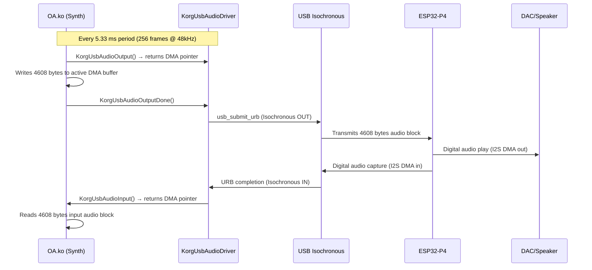

# Digital Audio and Codec Subsystem Specification {#sec:audio}

The Korg Kronos digital audio subsystem manages multi-channel, low-latency audio capture and playback. The Host's real-time synthesis engine streams PCM data over high-speed USB Isochronous endpoints, while hardware control (volume, routing, and clocking) is routed via the panel's Bulk OUT control path to the NV2AC virtual audio codec.

## Real-Time Audio Streaming Pipeline {#sec:audio-dataflow}

Audio streaming is managed by the Host driver `KorgUsbAudioDriver.ko`, which interacts with the synthesis engine `OA.ko` via a real-time DMA double-buffering scheme:

{#fig:audio-dataflow}



---

## Audio Stream Layout and PCM Format {#sec:audio-format}

To maintain hard real-time synchronization, the digital audio stream must adhere to strict sample and buffer format constraints:

| Audio Stream Parameter | Specification Value | Technical Detail |
| :--- | :---: | :--- |
| **Sample Rate** | 48,000 Hz | Fixed hardware sampling frequency |
| **Word Bit Depth** | 24-bit PCM | High-fidelity sample resolution |
| **Encoding Format** | Signed Little-Endian | Packed 3-byte samples: `[LSB, MID, MSB]` |
| **Total Audio Channels** | 6 Channels | 3 Stereo pairs (Input and Output) |
| **Output Channel Mapping** | Main L/R, Sub L/R, Individual L/R | Standard physical bus routing |
| **Frame Byte Stride** | 18 Bytes | $6 \text{ channels} \times 3 \text{ bytes per sample}$ |
| **DMA Buffer Period** | 256 Frames | Standard hardware processing period |
| **Period Data Block Size** | 4,608 Bytes | $256 \text{ frames} \times 18 \text{ bytes per frame}$ |
| **System Buffer Latency** | 5.33 ms | $\frac{256 \text{ frames}}{48,000 \text{ Hz}}$ |
| **Active URB Buffer Pool** | 2 (Double-Buffered) | Direct zero-copy Host DMA transfers |

---

## NV2AC Virtual Codec Control Protocol {#sec:nv2ac}

The NV2AC audio codec is configured using the panel interface's Bulk OUT endpoint (`EP2`) for writes and the Interrupt IN endpoint (`EP1`) for read acknowledgments. 

Every control packet uses the `NKS4Command` frame structure and must be byte-swapped per 32-bit word before transmission on the USB bus (see [@sec:byte-swap]).

### Codec Write Command Format (`0xE0`)

Codec configuration parameters are sent via Bulk OUT as type `0xE0` commands:
```
[0xE0] [reg_addr] [sub_addr] [data_byte] [mode_flag]
```

### Codec Read Command Format (`0xE1`)

Register reads (such as querying channel volumes) are initiated by writing a type `0xE1` command to the Bulk OUT endpoint:
```
[0xE1] [reg_addr_be32]
```
The coprocessor must capture the request and return the matching register state via the Interrupt IN endpoint.

### Codec Control Register Map

| Register Address | Sub-Address | Byte 2 | Byte 3 | USB Type | Target Operation |
| :---: | :---: | :---: | :---: | :---: | :--- |
| **`0x2A`** | `0x00` | config | config | `0xE0` | Initialize codec configuration A |
| **`0x2C`** | `0x00` | config | config | `0xE0` | Initialize codec configuration B |
| **`0xB2`** | `0x00` | channel | volume | **`0xE1`** | **Set / Read DAC Volume (Synchronous response required)** |
| **`0xB4`** | `0x03` | `0x00` | `0x00` | `0xE0` | Set physical output channel routing |
| **`0xB6`** | `0x00` | channel | status | `0xE0` | Enable (`0x01`) or disable (`0x00`) an audio channel |
| **`0xB8`** | `0x00` | `0x10` | `0x00` | `0xE0` | Configure hardware clock divider ($\div 16$ for 48kHz) |

### Active Channel Address Map

The NV2AC addresses stereo channel pairs rather than individual left/right buses. The synthesis engine `OA.ko` communicates with three active channel addresses:

| Channel Address | Target Physical Interface | Driver Initiators |
| :---: | :--- | :--- |
| **`0x10`** | Main Stereo Bus (Outputs 1 & 2) | `ParseAuths`, `VerifyAuthorizationString` |
| **`0x18`** | Sub Stereo Bus (Outputs 3 & 4) | `ParseAuths`, `VerifyAuthorizationString` |
| **`0x20`** | Individual Stereo Bus (Outputs 5 & 6) | `ParseAuths`, `VerifyAuthorizationString` |
| **`0x19`** | Hardware DRM Auth Enable | `SetupAtmelForAuthorizations` (Internal check) |
| **`0x50`** | Hardware DRM Auth Enable | `SetupAtmelForAuthorizations` (Internal check) |

*Channels `0x28`, `0x30`, and `0x38` are unused by the Host system.*

---

## Volume Control Mechanics and Timing Constraints {#sec:nv2ac-volume}

*   **Gain Range**: Maps to an 8-bit unsigned value from `0x00` (analog mute) to `0xFF` (maximum gain: +0 dB).
*   **System Default**: Boot default is initialized to `0x08` (near-mute, -36 dB attenuation).
*   **Write Latency Constraint**: The Host driver introduces a fixed 20-millisecond delay (`msleep(20)`) after writing a volume command, allowing the analog circuits to settle.
*   **Volume Write Protocol**: Volume writes (register `0xB2`) are processed via `stgNV2AC_sync_read_cmd` (type `0xE1`), which **blocks the calling thread** until a matching response packet is received via the Interrupt IN endpoint.

---

## Command Plaintext and Integrity {#sec:nv2ac-plaintext}

While `OA.ko` contains obfuscation layers (such as `bzzzzzzzzzzzt12`, which tracks the codec state in the BSS segment), these routines do not encrypt or modify the USB transmit buffers. All command packets sent via `stgNV2AC_sync_cmd` and `stgNV2AC_sync_read_cmd` arrive at the USB Host controller as plaintext register and sub-address structures:

```
Unswapped Type 0xE0/0xE1 Bulk OUT Frame: [register_addr, sub_addr, data_byte1, data_byte2]
```
The coprocessor's firmware can read configuration values directly from the incoming control packets.

### Synchronous Read Response Handshake (`0xE1`) {#sec:nv2ac-response}

When processing type `0xE1` commands (register `0xB2` volume updates), the coprocessor's USB firmware **must return a matching Interrupt IN response frame** to unblock the Host:

```
Interrupt IN Response Frame: [0x00, 0x00, 0x00, 0xE1]
```

*   **Verification**: The Host's driver only verifies that the read operation completed successfully (returning a status code of `0`). It does not validate the specific payload bytes.
*   **Timeout Bounds**: The response frame must arrive at the Host within **2 seconds** (`WaitOnAtmelRead` timeout is fixed at 2000 jiffies). If the coprocessor fails to respond, the Host thread deadlocks, halting audio system initialization.

---

## Digital Audio Capture (Recording Interface) {#sec:audio-input}

The coprocessor supports audio recording by streaming digitizer data from its high-speed ADC to the Host's isochronous IN endpoint:

```
[ ESP32-P4 ADC / I2S Input ]
              │
              ▼
   [ USB Isochronous IN ] (EP5)
              │
              ▼
[ KorgUsbAudioDriver.ko ] (Receives raw PCM frames)
              │
              ▼
   [ KorgUsbAudioInput() ] (Returns active DMA buffer)
              │
              ▼
           [ OA.ko ] (Reads 4608-byte sample block)
```

The capture stream mirrors the playback specifications: 24-bit signed little-endian PCM, 48,000 Hz sample rate, across 6 channels. If no physical audio inputs are connected, the coprocessor's firmware must transmit zero-valued blocks (`0x00`) to maintain isochronous stream synchronization.
